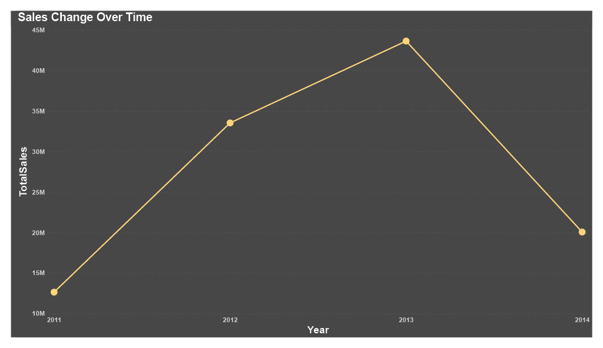

# AdventureWorks2019 Analysis

--

## Introduction
This is an Sql project, with data from the **Microsoft AdventureWorks2019 Database**. The goal of this project is to analyze sales and orders of products as it relates to customers in specific regions, with a view to answer crucial business questions thereby aiding decision making.

## Business Questions
- What are the most popular products among customers?
- Which geographical region has the most sales?
- How has sales volume changed over time?
- Which Territory generates the most revenue?

## Skills Demonstrated 
- Sql joins, aggregation, arithmetic and general data manipulation
- Critical thinking and an understanding of terms and concepts in sales
- Data visualization with powerbi and excel

## Cleaning and modelling 
For this analysis I had to work with 10 tables in total, consisting of 2 Fact tables and 8 dimension tables bound together by (1*) relationships. The tables include
- Sales.SalesOrderHeader
- Sales.Customer
- Sales.SalesPerson
- Sales.Territory
- Product.Product
- Sales.SalesOrderDetail
- Purchasing.PurchaseOrderHeader
- Purchasing.Vendor
- Purchasing.PurchaseOrderDetail
- Production.WorkOrder

--
Data cleaning was done individualy for all tables because different aspects of the business question required very specific details from  the said table. Some cleaning techniques employed include during this process includes
- Table in use was extracted from the parent database, so as not to distort the files in their original location
- Dropping irrelevant columns
- Columns were renamed 
- Data types changed to the appropriate type 

Below is a sample code of extraction and a few of the techniques mentioned above, the tables involved are the SalesOrderHeade and Sales.Territory 

--

## Visuals and codes to answer the business questions

- **_What are the most popular products_**
 
  

 
- **_Geographical region with the most sales_**

 
- **_How Sales volume has changed over time_**
 

 
 -**_Which Territory generates the most revenue_**
 

 
 ## Report Dashboard
 

## Insights from analysis 
 
 - Total revenue between 2011-2014 amounted to $109 million dollars, with the bike sales responsible for more than half of the total revenue generated.
 - Sales were on an upward trajectory from 2011 and peaked in 2013 with sales totaling over $40 million dollars, however after that it had a downward trajectory, with sales going      to as low as $20 million dollars, the lowest in almost 2 years.
 - North America is outrighly responsible for most of the sales, sales of over $30 million dollars, more than 3 times that of Europe in seond place. The Pacific region comes in a      distant third with about 11.3% in sales amounting to $6 million dollars
 - The Water Bottle Oz tops the list of product popularity with orders of over 4 thousand in total , Patch kits comes in second place with over 3 thousand orders in total.
 - Sales was unstable between 2011 amd 2014, maainly due to the fact that Adventureworks deal in seasonal products

## Recommendations 
  
 - The disparity in total sales in regions can be leveld up by focusing advert campaigns more in countries in Europe and the Pacific
 - Venturing into more all-season products will help circumvent the drop in sales during off-seasons
 
 
 
 
 

